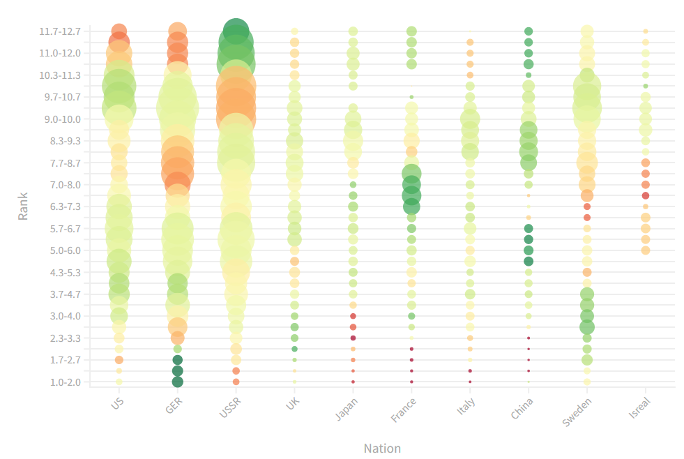
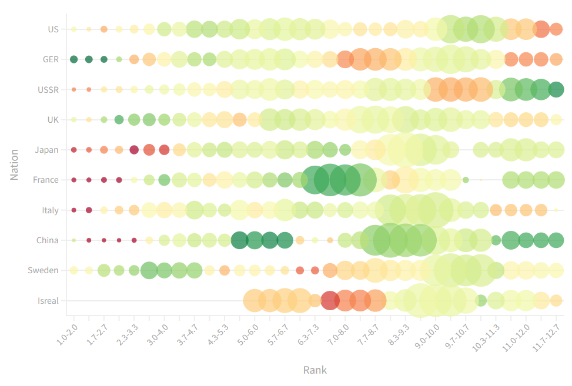

| [home page](https://tcanchii.github.io/Telling-Stories-Repository/) | [visualizing debt](visualizing-government-debt) | [critique by design](critique-by-design) | [final project I](final-project-part-one) | [final project II](final-project-part-two) | [final project III](final-project-part-three) |

# Critique By Design

For many games, the initial decisions you make can lock you into hours of gameplay and, being new, you don't have much prior knowledge to make these decisions optimally. To progress in the game War Thunder a player is required to pick a specific nation they want and spend hours with that chosen nation to unlock new higher tier vehicles for that specific nation. This makes it so once you've picked a nation, it is incredibly time consuming to switch to another. Therefore, a natural question arises about what a good choice would be.

# Data Source and Basic Critique
To answer this question, many new players look at winrate statistics to see which nations have the strongest competitive viability. A popular website to do so would be the [War Thunder Data Project](https://wt.controlnet.space/) which has these statistics. Unfortunately, winrates don't tell the whole story by themselves since you need to also know how much time you are playing at a specific battle rating \(the game's "weight class" system for vehicle progression teirs\). For example, a nation that has a 90% winrate at a specific rating but the average player only spends an hour at that point in the game is going to be less appealing to most people than one that has a 60% winrate at a rating where the average player plays most of the game at. 

The data source has the information to address the issue, but the information is split between two of their data visualizations which cannot be easily combined.

# Solution Attempt

To address this I scraped the (data)[WT WR 09-14.xlsx) and used it alongside flourish studio to generate a visualization that is more suitable for answering what nation to play. Since the time people play at a rating isn't a statistic I could find, I used number of games played as a variable that should be highly correlated with play time. 

My first attempt was to use something that can capture both the number of games played alongside the winrates to provide the information needed to find any "hot spots" or things where a high winrate and number of games aling as. 

To do this, I made a bubble chart where the color corresponds to the winrate and the size corresponds to the number of games played. The hope was that any nation with large spots that are green would be good ones to play and large ones with red would be those to avoid.

# Suggestion 1

After showing it to my friend, two things became very clear:

First, the usage of total games at a rating for size was not what I wanted to be using. This gives the information on what nations are popular, but does not highlight the relevant information where, once a nation is picked, most of your time will be spent. To address this, I fixed the sizing to be based on the % of total games within a specific nation so the size corresponds to an estimate of the time spent at each rating.

Second, time is usually used as the x-axis so adjusting the rating to be the x-axis makes more sense as the rating is a time progression. 

# Suggestion 2
After making those changes I showed the second draft to my brother:

He suggested that the numbering should be more clear and that the proper term "Battle Rating" should be used instead of the more informal "rank". After making these changes this lead me to the final product:

