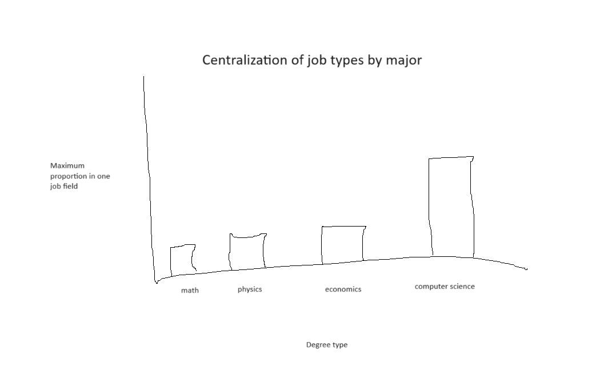
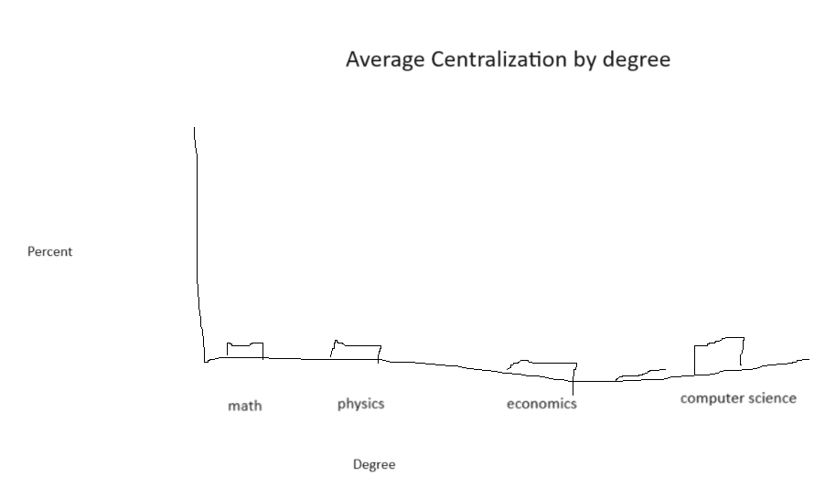
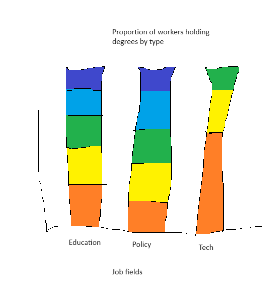

| [home page](https://tcanchii.github.io/Telling-Stories-Repository/) | [visualizing debt](visualizing-government-debt) | [critique by design](critique-by-design) | [final project I](final-project-part-one) | [final project II](final-project-part-two) | [final project III](final-project-part-three) |

# Outline
 
Initially the goal of the project was to highlight the breadth of what mathematics can be used for by looking at census data on jobs held by people who have gotten math degrees. While the premise that math is useful in just about everything is true, the data was not substantially supportive of this since most of the degrees I looked at had a similar breadth of jobs associated with their graduates. As a result, the new project idea I have is to highlight how the specific degrees don't matter in the modern day job market as much as one might expect. The story is that there are some very specialized degrees if you know where you want to end up, but for the most part degrees don't lock you into a specific type of job.

The story would start with the idea that your degree would be important for setting yourself up for success in a given field, starting off with degrees like computer science where "most" of the individuals go into the same type of field. Then we would take notice that there is still a majority of them doing other types of jobs and switch to looking at other degrees like economics, physics, math, etc and seeing the ceiling on how specialized a degree's job opportunities are. Then I would go into the the analysis of the so what, where it is more about skill development rather than as a prerequisite for a specific job.

## Initial sketches

The graphics I anticipate to be showing are the breakdowns for the maximum percent of graduates of a specific degree go into a single job type and the average of that same percent. Both should be relatively small from what I've seen which should highlight how well dispersed jobs are. It is difficult to make detailed sketches without actually doing the data analysis, but there might be something more interesting to glean from the data. Intentionally, these are not very colorful since there isn't really anything to point out since most are very low. If there are weird outliers beyond what I would expect then I might consider highlighting them with red or another color that draws attention to it.

 

The other visual that might be beneficial would be breaking down the jobs by degree type \(colors\) and then showing that most aren't over centralized. I was thinking it might be interesting to show this "piecemeal" during the flow of the powerpoint where they are added one at a time to highlight first that math looks spread out then that all are with some few outliers.

# The data
The data source I have is the census data that I pulled from [this website](https://datausa.io/). I'll need to pull the data from each page individually but as a sample, here is the [data](data2.csv) for jobs held by those with degrees in mathematics. 

# Method and medium

I plan on using shorthand to create the visualization page. 
