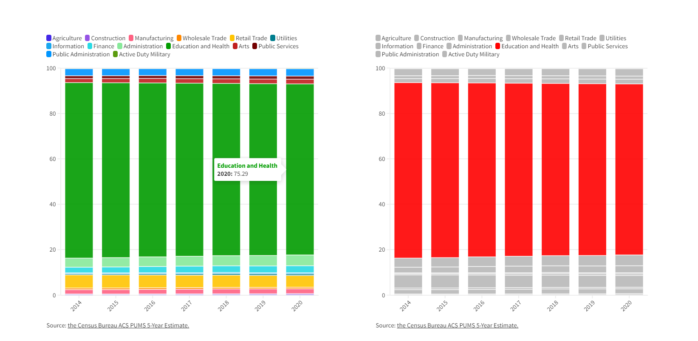
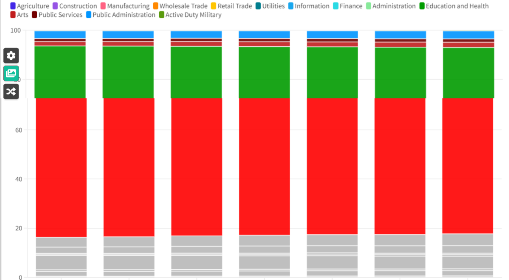

| [home page](https://tcanchii.github.io/Telling-Stories-Repository/) | [visualizing debt](visualizing-government-debt) | [critique by design](critique-by-design) | [final project I](final-project-part-one) | [final project II](final-project-part-two) | [final project III](final-project-part-three) |

# The final data story
[The final story can be found here](https://carnegiemellon.shorthandstories.com/does-your-university-degree-pigeonhole-you/index.html)

## Changes made since Part II
Some of the major feedback I wanted to focus on were colors, transitions/presentations of the content, and integrating the call to action throughout the presentation. 

# Colors
For the colors, I aimed to adjust them to something that continued to highlight the data I wanted while being a little easier on the eyes. I started with this:

 
and went through multiple of the flourish color pallets and experimented with a few of my own. All the ones I tried either looked worse to look at but highligted the data, or looked better but did not give the impression I was looking for where it should subtly highlight the largest share of the graph. As an example, this color pallet looks nicer but "muddies" how much larger Education & Health is compared to the rest of the graph:

Perhaps being slightly red-green colorblind pushes green to be a more "alert" color for me, but the initial green I used felt like a very effective color for making the large category "pop" while not being as obvious/obnoxious as a harsher red. Ultimately, I stuck with the initial color scheme since it was doing everything I aimed for.

# Transitions and Presentation
I was not fully satisfied with the presentation of the data. The graphs were large, there was too much text, and I felt as though I needed to walk an audience more through the analysis since the graphs, while related were bridged together by more text than I wanted.

For the text in the graphs, I significantly shortened the names of the job fields from something such as "Agriculture, Forestry, Fishing and Hunting, and Mining" to "Agriculture" since the specific nuances of what the job fields are is not as important as the distinct categories provided. While these categories are less accurate, they provide enough of a flavoring of the types of jobs where the context needed to understand the graph is not lost while reducing the information clutter that makes parsing the information harder. 

The specific transition I aimed to fix was the transition between the first and second set of graphs. In the first set of graphs I provide major specific data and walk the reader through what to look for using text, followed by another set of graphs that require the reader to have paid attention to the nuances of the text provided. Given my target audience \(discussed later in detail\) is at the high school level, I felt the need for the graphs themselves should be easy enough to follow where it tells the majority of the story without assistance. In my final graph I show the job with the largest portion of the workforce of graduates from each type of degree to highlight how centralized each major is in any one field. This is easier to show than explain, and so I aimed to include a transitionary graph that emphasizes exactly the portion of the graphs we care about. As an example these graphs:

transition to:

so when we end on the below graph, it is easy to see follow where the data comes from:

Since the graphs are all relatively large, my first instinct was to condense each graph side by side with the new transition one. The issue I ran into was that Shorthand's likes to fit full pages with the content and this ended up stretching the graphs where the relative sizes of proportions were a little warped:

My next approach was to make use of Shorthand's background transition feature. Picture starting with the initial fully colored graph, then as you scroll down the colors drop out and you get the graph with the specific section highlighted. As interesting of an idea this makes, in practice with how Shorthand fills the page and the lack of interactivity with images \( the backgrounds you transition through must all be still images\) lead to a degredation in graphic quality and made the portion of the presentation a lot more confusing to navigate.

Ultimately I ended up going with the initial sized graphs but weaved them into the narrative more. This allowed me to make the transition to the final graph a lot smoother, made the narrative easier to follow, and reduced the number of words substantially.

In doing the above, I got rid of this graphic as it no longer had a place to fit and was no longer necessary for the story:

# The Audience and Call to Action
Initially the audience was aimed at both high schoolers going to college and parents of high schoolers but when I started writing the Shorthand it flowed a lot more naturally with a more focused audience. I then reduced it to just high schoolers but this proved a little difficult to pin down a call to action due to the vastly different desires and life paths one might take. The overall story was initially about how "what degree you pick doesn't matter" so I focused my audience further to just high schoolers applying to college, but even this felt a little too broad. There are so many different and important concerns a high schooler might have for a degree that my story and data just doesn't cover such as expected wages or employment rates. When I started to write the final presentation, I figured out how to put to words the specific story I'm trying to tell. I am not telling the story of "why your degree doesn't matter" but instead I am telling the stroy of how "the degree choice you make does not force you into any specific career path". 

Once I figured out the way to properly word my overall stroy idea, I pinpointed by audience to specifically high schoolers worried that the degree they apply for will lock them into a career path they have no hopes to escape if they don't like it. With that in mind, my call to action would be a clear idea that most degrees don't lock you into a career and that picking something that's just interesting is a legitimate strategy. That ultimately, getting stuck in a career field is not that likely and a high schooler should not worry so much as the degree they might pursue won't substantially change that. 

With that locked in I made some minor adjustments to the call to action but the overall sentiment of relaxing is the same.

## Final design decisions
The overall design decisions I went with was to frame the whole thing as a journey, starting and ending with images that invoke a sense of travel. At the start I address the main aspect of the target audience by bringing up the feeling of anxiety towards a major life decision, then transition to the data. I go through the data not as a presentation of results but instead as a step by step walk through some of the key features. This continues the overall journey narrative and hopefully goes from a relatively familiar place \(high schoolers are likely used to looking at categorical graphs that don't have significant synthesis built into them\) and gradually moves to a graph that is the synthesis of what they are looking for. The overall presentation ends with a hopefully calming sunset picture that aims to provide the feeling that the journey is coming to a relaxed closing. 

# Final thoughts
There are lots of places where I think I could expand upon the topic. In the Audience and Call to Action section I mention that I heavily focus in on a specific target audience to talk to, but I think this whole presentation would be more compelling with a broader look at high schoolers' decision to go to college \(or not
) and the effect that decision has on their life. To do so would likely require the entire course's length just to compile the data and so unfortunately this is something to look at as a future research topic.
